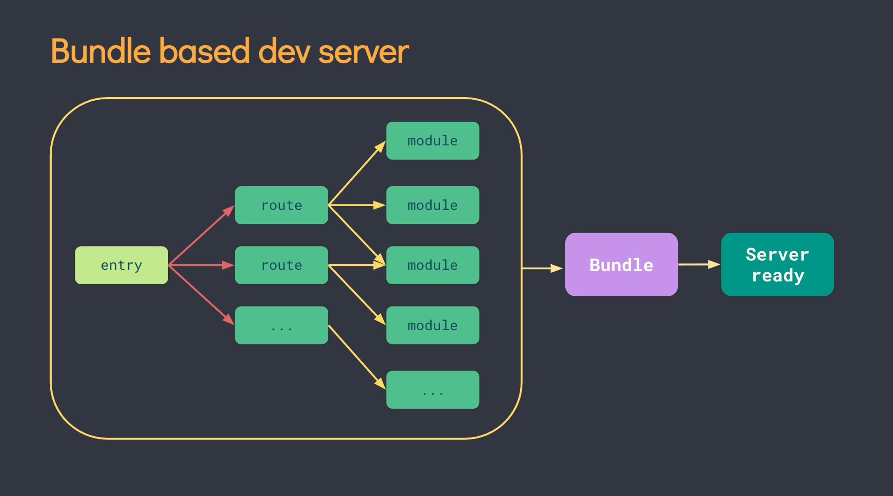

<aside>
🔎 Vite(프랑스어로 "빠르다(Quick)"를 의미합니다.)은 빠르고 간결한 모던 웹 프로젝트 개발 경험에 초점을 맞춰 탄생한 빌드 도구입니다.
- [Vite](https://vitejs.dev/) 공식 문서 -

</aside>

# 문제점🐢

브라우저에서 ESM을 지원하기 전까지는, JavaScript 모듈화를 네이티브 레벨에서 진행할수 없었다. 따라서 개발자들은 “번들링(Bundling)”이라는 우회적인 방법을 통해 모듈을 사용하였고, Webpack, Rollup, Parcel과 같은 번들링 도구는 프론트엔드 개발자의 생산성을 크게 향상시킬 수 있었다.

하지만 애플리케이션이 점점 더 발전함에 따라 처리해야 하는 JavaScript 모듈이 기하급수적으로 증가하게 되었고, 이러한 상황에서 JavaScript 기반의 도구는 성능 병목 현상이 일어나기 시작했다. 개발 서버를 가동하거나 HMR시 오랜 시간이 소요되었고, 이런 느린 피드백 루프는 개발자의 생산성과 행복에 영향을 주었다.

# Vite를 사용해야 하는 이유

## 즉각적인 서버 실행

> ESM을 기반으로 하여 번들을 생성하는 과정이 필요하지 않아 서버의 시작속도가 매우 빠릅니다.
> 

### 기존 번들러 도구의 문제점

cold-start 방식(* 최초로 실행되어 이전에 캐싱한 데이터가 없는 경우)으로 개발 서버를 구동할 때, 번들러 기반의 도구의 경우 애플리케이션 내 모든 소스 코드에 대해 크롤링 및 빌드 작업을 마쳐야지만이 실제 페이지를 제공할 수 있었다.

### Vite는 어떻게 해결했나?

Vite에서는 이 문제를 dependencies(패키지) 그리고 source code(소스코드)로 분리하여 개발 서버를 시작하도록 함으로써 해결했다.

Dependencies는 개발시 그 내용이 바뀌지 않을 plain JavaScript 소스코드이다. 기존 번들러로는 몇 백 개의 JavaScript 모듈을 갖고있는 컴포넌트처럼 의존성이 큰 경우에 대한 번들링 과정이 매우 비효율적이었다. Vite에서는 패키지를 Esbulid를 통해 사전 번들링해두어 소스코드를 불러오면서 의존성이 있는 패키지만 가져오도록 한다. Esbulid는 Webpack, Parcel과 같은 기존 번들러 대비 10-100배 빠른 번들링 속도를 보인다.

그렇다면, 컴파일링이 필요하고 수정 또한 매우 잦은 non-plain JavaScript 소스코드는 어떻게 할까? (예: JSX, CSS, Vue/Svelte 컴포넌트…) Vite는 Native ESM을 기반으로 하기 때문에 브라우저가 소스코드를 불러오면서 의존성이 있는 모듈을 전달해주는 역할을 한다. 따라서 dynamic import 이후의 코드는 현재 화면에서 실제로 사용이 되어야만 처리가 된다.

## HMR

기존의 번들러는 소스코드가 업데이트되면 번들링 과정을 다시 거쳐야만 했다. 따라서 서비스가 커질수록 소스코드 갱신 시간 또한 선형적으로 증가할 수 밖에 없었다.

Vite는 ESM을 이용하여 HMR을 지원한다. 어떤 모듈이 수정되면 수정된 모듈과 관련된 부분만을 교체하고, 브라우저에서 해당 모듈을 요청하면 교체된 모듈을 전달한다. 전 과정에서 완벽하게 ESM을 이용하기에, 앱 사이즈가 커져도 HMR을 포함한 갱신 시간에는 영향을 끼치지 않는다. 또한 HTTP 헤더를 이용해 필요에 따라 소스코드는 304 Not Modified로, 디펜던시는 Cache-Control: max-age=31536000,immutable 을 이용해 캐시되도록 함으로써, 한 번의 요청이라도 덜 하도록 하였다.