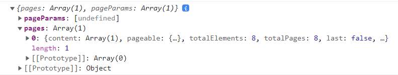

- data : 현재 데이터
- data.pages : page 배열
- data.pageParams : page를 fetch하는데에  사용되는 page params를 포함하는 배열
- fetchNextPage
- getNextPageParam : 더 불러올 데이터가 있는지 결정하기 위한 옵션.
- hasNextPage: getNextPageParam이 undefined가 아닌 값을 리턴하면 true

data 구조

